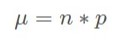

# rkb_distributions package
This package include Gaussian and Binomial distribution packages. It's come with mean, standard deviation and plot histogram. You can easily calculate and find probability.

## File
file details 
- Gaussian()
- Binomial()

Methods:
- mean (expected value or average)
- stdev (standard deviation)

## Formula:
#### Gaussian Distribution Formulas
**probability density function**


#### Binomial Distribution Formulas
**mean**



**variance**


**standard deviation**


**probability density function**


## Installation
Install using pip:
```
pip install rkb-probability
```
## Initialization
Ptyhon interpreter or .py file use this:
```
from rkb_probability import Gaussian, Binomial

obj1 = Gaussian(10, 4)
print(obj1.mean)

obj2 = Binomial(.4, 25)
print(obj.stdev)

```
## Package PyPl
Also this package you can download from [PyPl.org](https://pypi.org/project/rkb-probability/)
